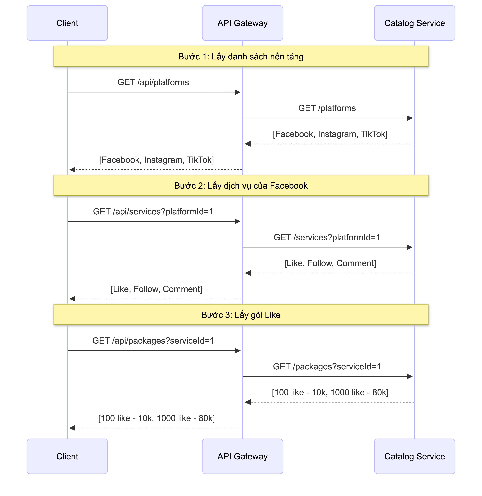
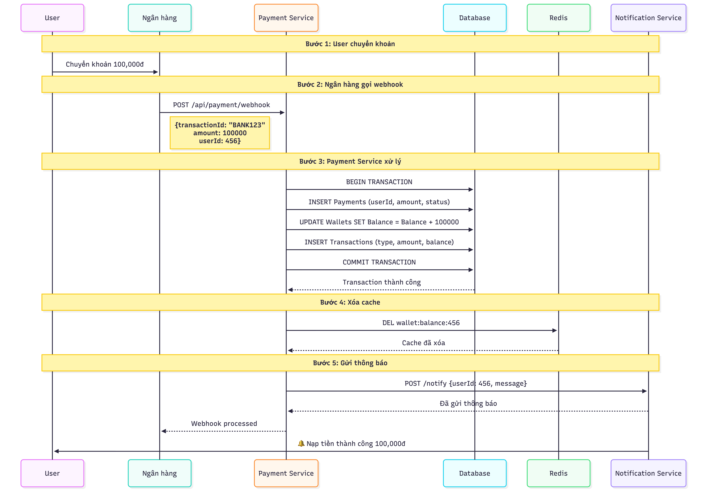
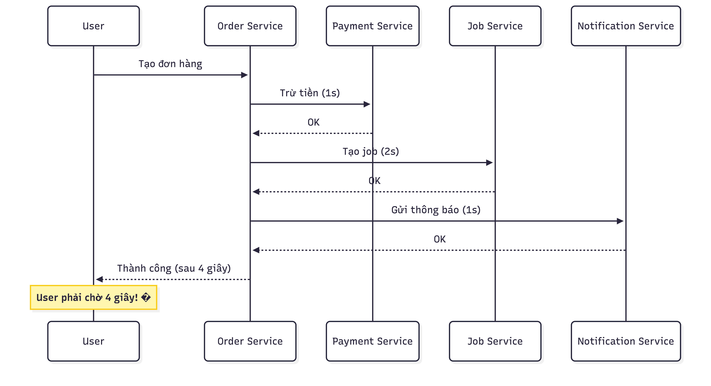
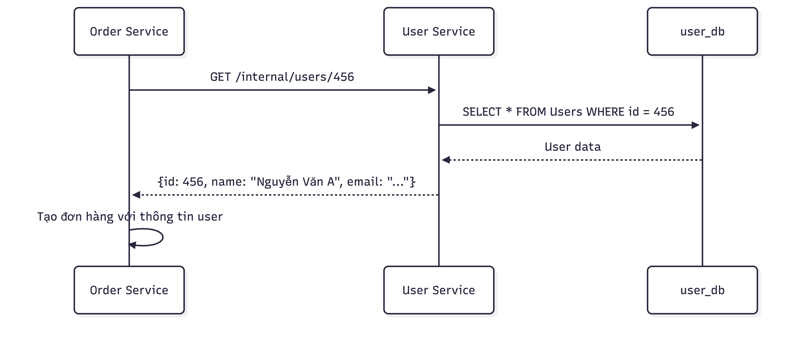
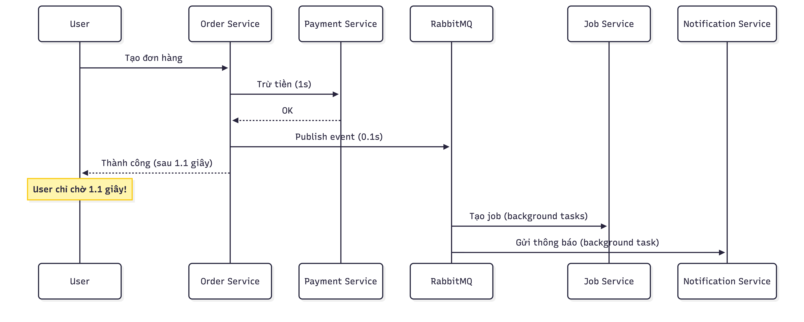
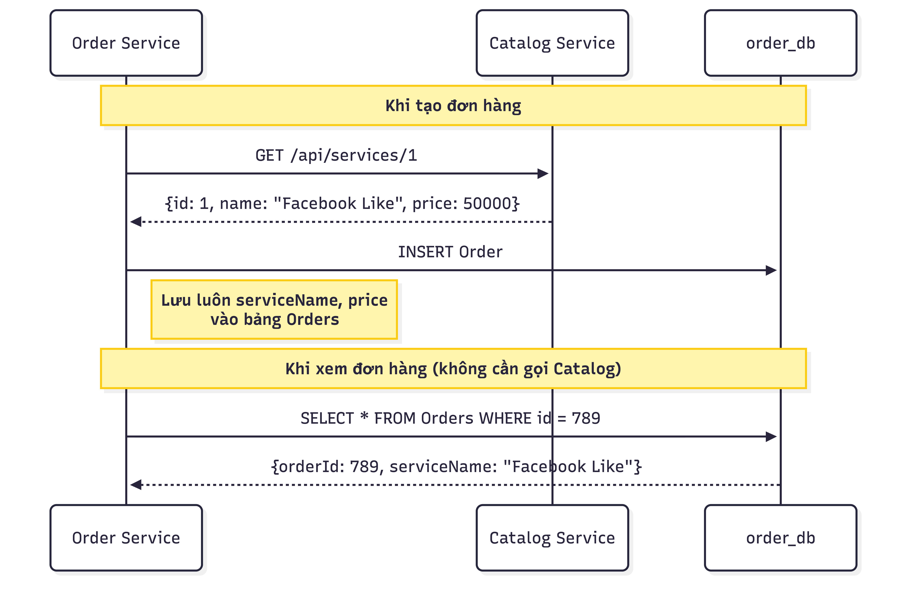
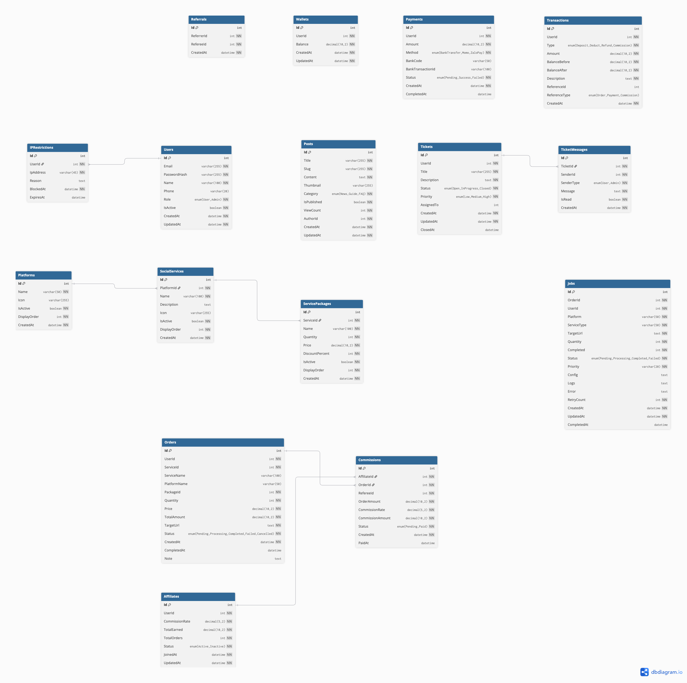

<div align="left">

# 📊 Data Visualization & Diagramming Practice

*A comprehensive practice repository for mastering data visualization, charts, and technical diagrams*

[](https://opensource.org/licenses/MIT)
[](http://makeapullrequest.com)

</div>

<div align="left">


</div>

---

## 🎯 Overview

This repository serves as a hands-on learning environment for developing proficiency in data visualization and technical diagramming. Through practical exercises and real-world scenarios, I'm building expertise in creating clear, impactful visual representations of complex data and system architectures.


## 🗂️ Repository Structure

```
charting-and-diagram-practice/
├── diagrams/                           # Source diagram files
│   ├── erd/                            # Entity Relationship Diagrams
│   ├── sequence-diagram/               # Sequence diagrams
│   └── system-architecture-diagram/    # Architecture designs
├── flowchart/                          # Process flowcharts
└── use-case/                           # Use case diagrams
```

## 🎨 Featured Diagrams

### System Architecture

#### 1. Microservices Architecture

<div align="center">
  
  <p>
    <em>https://drive.google.com/file/d/1jIH5deTAiAN4S-mBDxl1IrkdK66DKw8W/view?usp=sharing</em>
  </p>
</div>

**Tools:** Gemini AI + Draw.io

**Description:** Microservices diagram with API Gateway as the main entry point, independent services with separate databases. This design makes it easy to scale individual services and deploy independently without affecting the entire system.

<br/>

<div align="center">
  
  <p>
    <em>https://sunteco.vn/11-thanh-phan-quan-trong-trong-kien-truc-microservices-phan-1/</em>
  </p>
</div>

**Tools:** Reference diagram from Sunteco.vn

**Description:** Reference diagram from an article about 11 important components in microservices architecture. Includes service discovery, load balancer, circuit breaker, and monitoring - essential components for real-world microservices deployment.

<br/>

#### 2. Admin Service System Architecture

<div align="center">
  
</div>

**Tools:** Amazon Q + Mermaid.ai

**Description:** Admin Service as central hub querying User, Order, Payment, and Job services. Each service has its own database for data isolation.

<br/>


<hr/>

### Sequence Diagrams

#### 1. Admin Dashboard Sequence Diagram

<div align="center">
  
</div>

**Tools:** Amazon Q + Mermaid.ai

**Description:** Admin opens dashboard and fetches statistics from User, Order, and Payment services through API calls. Each service returns data (user stats, order stats, revenue) which the frontend aggregates and displays.

<br/>

#### 2. Catalog Service Sequence Diagram

<div align="center">
  
</div>

**Tools:** Amazon Q + Mermaid.ai

**Description:** Three-step workflow: Client fetches platform list (Facebook, Instagram, TikTok), selects a platform to get available services (Like, Follow, Comment), then retrieves pricing packages for the chosen service.

<br/>

#### 3. User Service Sequence Diagram

<div align="center">
  
</div>

**Tools:** Amazon Q + Mermaid.ai

**Description:** Complete user authentication flow in three steps: registration (email validation, create user and wallet), login (verify credentials, generate JWT token), and profile access (verify JWT, fetch user data and wallet balance from database and Redis cache).

<br/>

#### 4. Transaction Sequence Diagram

<div align="center">
  
</div>

**Tools:** Amazon Q + Mermaid.ai

**Description:** Payment flow from bank webhook to user notification. Bank sends transaction data, Payment Service processes it with database transaction (insert payment, update wallet, log transaction), invalidates Redis cache, and triggers notification to user.

<br/>

#### 5. Referral Commission Sequence Diagram

<div align="center">
  
</div>

**Tools:** Amazon Q + Mermaid.ai

**Description:** Referral commission flow in three steps: User B registers via User A's referral link, User B creates an order (Order Service fetches referral data and creates commission for User A), order completes and Payment Service adds commission to User A's wallet.

<br/>

#### 6. Notification Sequence Diagram

<div align="center">
  
</div>

**Tools:** Amazon Q + Mermaid.ai

**Description:** Real-time notification flow when order is created. Client creates order, Order Service saves it and sends notification event to Notification Service, which pushes the message to user via WebSocket for instant updates.

<br/>

#### 7. Post Ticket Sequence Diagram

<div align="center">
  
</div>

**Tools:** Amazon Q + Mermaid.ai

**Description:** Support ticket workflow with real-time chat. User creates ticket, Admin views ticket list and connects via WebSocket for live chat. Messages are saved to database and pushed instantly to both parties. Admin closes ticket when resolved.

<br/>

#### 8. HTTP-Only Flow Sequence Diagram

<div align="center">
  
</div>

**Tools:** Amazon Q + Mermaid.ai

**Description:** Order creation flow using synchronous HTTP API calls across all services. User creates order, Order Service sequentially calls Payment Service (deduct balance - 1s), Job Service (create job - 2s), and Notification Service (send notification - 1s). Total response time is 4 seconds as user must wait for all operations to complete before receiving success response. This diagram illustrates the performance impact of synchronous HTTP-only architecture.

<br/>

#### 9. Order Service Data Sharing Sequence Diagram

<div align="center">
  
</div>

**Tools:** Amazon Q + Mermaid.ai

**Description:** Data sharing pattern between microservices. Order Service calls User Service internal API to get user data instead of accessing database directly. This maintains service independence and database isolation.

<br/>

#### 10. Message Queue Sequence Diagram

<div align="center">
  
</div>

**Tools:** Amazon Q + Mermaid.ai

**Description:** Asynchronous order processing using RabbitMQ message queue. User creates order, Order Service deducts payment (1s) then publishes event to RabbitMQ (0.1s) and immediately returns success to user in 1.1 seconds. Job Service and Notification Service process tasks in background by consuming messages from queue. This reduces response time from 4 seconds (HTTP-only) to 1.1 seconds while maintaining reliability.

<br/>

#### 11. Data Replication Sequence Diagram

<div align="center">
  
</div>

**Tools:** Amazon Q + Mermaid.ai

**Description:** Data replication pattern to reduce service dependencies. When creating order, Order Service fetches service details from Catalog Service and stores serviceName and price directly in Orders table. When viewing order, data is read from local database without calling Catalog Service, improving performance and reducing inter-service calls.

<br/>

#### 12. Example Sharing Sequence Diagram

<div align="center">
  
</div>

**Tools:** Amazon Q + Mermaid.ai

**Description:** Comparison of two data sharing approaches in microservices. HTTP approach: Service A directly calls Service B API to get data synchronously. Message Queue approach: Service A publishes event to queue, Service B consumes and processes asynchronously. Demonstrates trade-offs between immediate response (HTTP) and decoupled architecture (Message Queue).

<br/>


<hr/>

### Entity Relationship Diagrams (ERD)

#### 1. LikeSub VIP Database Schema

<div align="center">
  
</div>

**Tools:** Amazon Q + Mermaid.ai

**Description:** Complete database schema for LikeSub VIP platform showing relationships between core entities: Users, Wallets, Orders, Transactions, Packages, Services, Platforms, and supporting tables for referrals, notifications, and admin management. The ERD illustrates foreign key relationships, primary keys, and data types for each field, providing a comprehensive view of the system's data architecture.

<br/><br/>

<div align="center">
  
  <p>
    <em>https://dbdiagram.io/d/Likesub-VIP-ERD-697f997bbd82f5fce2451e5e</em>
  </p>
</div>

**Tools:** Amazon Q + dbdiagram.io

**Description:** Alternative visualization of the LikeSub VIP database schema created with dbdiagram.io. This version provides a cleaner, more structured layout of the same database entities and relationships, making it easier to understand the data flow and table connections in the system.
<hr/>

### Use Case Diagrams

#### 1. Social Media Seeding Use Case

<div align="center">
  
  <p>
    <em>https://drive.google.com/file/d/1kEJH04aHo2yVr6EVNVzh1GoZKhIKEugU/view?usp=sharing</em>
  </p>
</div>

**Tools:** Gemini AI + Draw.io

**Description:** Use case diagram for social media seeding system. Shows the workflow from content creation, scheduling posts, to performance analytics. Clear role separation between Admin and Seeder, with integration to social media platforms through APIs.

---

<div align="center">

**Built with 💙 for continuous learning and improvement**

*Last Updated: 2024*

</div>