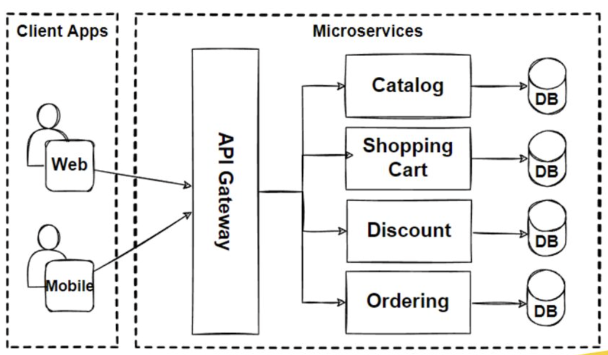
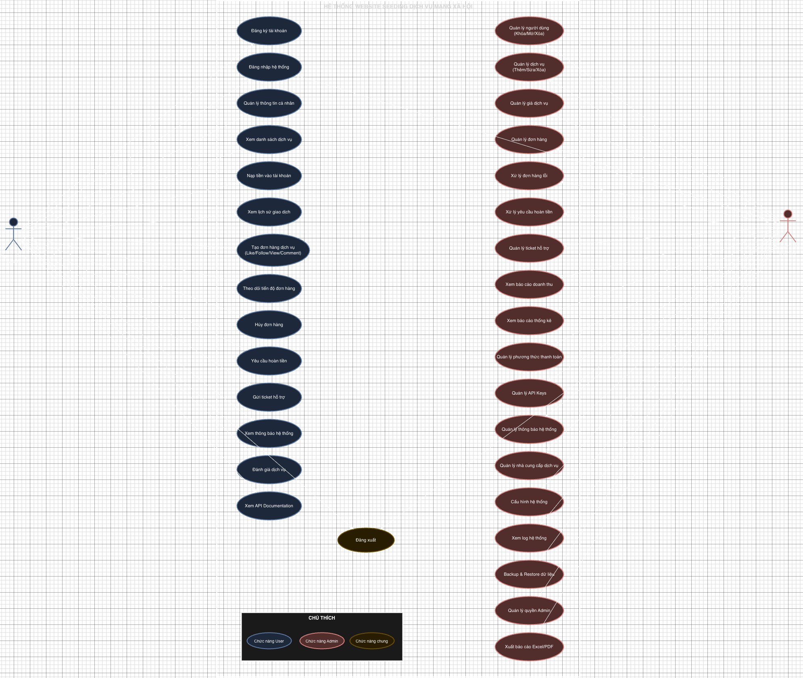

<div align="center">

# 📊 Data Visualization & Diagramming Practice

*A comprehensive practice repository for mastering data visualization, charts, and technical diagrams*

[](https://opensource.org/licenses/MIT)
[](http://makeapullrequest.com)


</div>

---

## 🎯 Overview

This repository serves as a hands-on learning environment for developing proficiency in data visualization and technical diagramming. Through practical exercises and real-world scenarios, I'm building expertise in creating clear, impactful visual representations of complex data and system architectures.


## 🗂️ Repository Structure

```
charting-and-diagram-practice/
├── diagrams/          # Technical diagrams and flowcharts
├── charts/            # Data visualization examples
├── uml/               # UML diagrams (class, sequence, etc.)
├── examples/          # Practice exercises and samples
└── resources/         # Learning materials and references
```

## 🎨 Featured Diagrams

### System Architecture

#### 1. Microservices Architecture

<div align="center">
  
  <p>
    <em>https://drive.google.com/file/d/1jIH5deTAiAN4S-mBDxl1IrkdK66DKw8W/view?usp=sharing</em>
  </p>
</div>

**Tools:** Gemini AI + Draw.io

**Description:** Microservices diagram with API Gateway as the main entry point, independent services with separate databases. This design makes it easy to scale individual services and deploy independently without affecting the entire system.

<br/>

<div align="center">
  
  <p>
    <em>https://sunteco.vn/11-thanh-phan-quan-trong-trong-kien-truc-microservices-phan-1/</em>
  </p>
</div>

**Tools:** Reference diagram from Sunteco.vn

**Description:** Reference diagram from an article about 11 important components in microservices architecture. Includes service discovery, load balancer, circuit breaker, and monitoring - essential components for real-world microservices deployment.

<br/>


<hr/>

### Use Case Diagrams

#### 1. Social Media Seeding Use Case

<div align="center">
  
  <p>
    <em>https://drive.google.com/file/d/1kEJH04aHo2yVr6EVNVzh1GoZKhIKEugU/view?usp=sharing</em>
  </p>
</div>

**Tools:** Gemini AI + Draw.io

**Description:** Use case diagram for social media seeding system. Shows the workflow from content creation, scheduling posts, to performance analytics. Clear role separation between Admin and Seeder, with integration to social media platforms through APIs.

---

<div align="center">

**Built with 💙 for continuous learning and improvement**

*Last Updated: 2024*

</div>